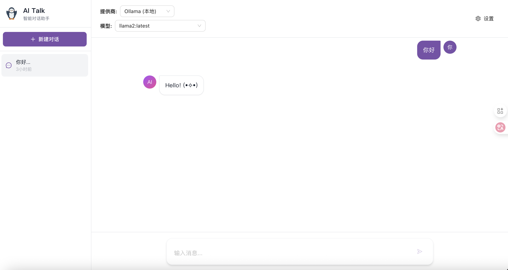

<div align="center">
  
  
  # 🐧 AI Talk - 智能对话应用
  
  <p>
    <strong>支持多模型的智能对话助手</strong>
  </p>
  
  <p>
    本地部署 · 云端API · 流式对话 · 多会话管理
  </p>
  
  <p>
    
    
    
    
  </p>
</div>

---

一个支持多模型的AI对话应用，用户可以选择本地部署的大模型（通过Ollama）或远程API模型进行流式对话交互。

## ✨ 功能特性

- 🤖 **多模型支持**
  - 本地模型（通过Ollama部署）
  - 远程模型（OpenAI、Claude等）
  - 灵活切换不同的AI模型

- 💬 **流式对话**
  - 实时响应显示
  - 打字机效果
  - 可中断生成

- 🎨 **现代化UI**
  - 基于React + Ant Design
  - 响应式设计
  - 深色/浅色主题切换
  - Markdown渲染
  - 代码高亮显示

- 📝 **会话管理**
  - 多会话支持
  - 历史记录保存
  - 本地持久化存储

- ⚙️ **灵活配置**
  - 模型参数调整（温度、最大令牌数）
  - API Key管理
  - 个性化设置

##  🚀 页面展示


## 🛠 技术栈

### 前端
- React 18
- TypeScript
- Vite
- Ant Design
- Zustand（状态管理）
- Tailwind CSS
- React Markdown

### 后端
- Node.js 18
- Express
- TypeScript
- Ollama SDK
- OpenAI SDK
- Anthropic SDK (Claude)

## 📦 快速开始

### 前置要求

- Node.js 18+
- Docker & Docker Compose（可选，用于容器化部署）
- Ollama（可选，用于本地模型）

### 安装 Ollama（可选）

如果你想使用本地模型，需要先安装Ollama：

```bash
# macOS
brew install ollama

# Linux
curl -fsSL https://ollama.com/install.sh | sh

# 启动Ollama服务
ollama serve

# 拉取模型（例如llama2）
ollama pull llama2
```

### 开发环境运行

#### 1. 克隆项目

```bash
git clone <repository-url>
cd ai-talk
```

#### 2. 安装依赖

```bash
# 安装后端依赖
cd backend
npm install

# 安装前端依赖
cd ../frontend
npm install
```

#### 3. 配置环境变量

后端配置：
```bash
cd backend
cp .env.example .env
# 编辑 .env 文件，配置必要的环境变量
```

前端配置：
```bash
cd frontend
cp .env.example .env
# 编辑 .env 文件
```

#### 4. 启动应用

在两个终端窗口中分别运行：

```bash
# 终端1 - 启动后端
cd backend
npm run dev

# 终端2 - 启动前端
cd frontend
npm run dev
```

访问 http://localhost:5173 即可使用应用。

### Docker部署

使用Docker Compose可以一键启动所有服务：

```bash
# 构建并启动所有服务
docker-compose up -d

# 查看日志
docker-compose logs -f

# 停止服务
docker-compose down
```

服务启动后：
- 前端：http://localhost
- 后端：http://localhost:3080
- Ollama：http://localhost:11434

## 📖 使用指南

### 1. 配置API Key（使用远程模型）

如果你想使用OpenAI或Claude等远程模型：

1. 点击右上角的"设置"按钮
2. 在"API配置"标签页中输入对应的API Key
3. 点击"保存"

### 2. 选择模型

1. 在顶部选择提供商（Ollama、OpenAI或Claude）
2. 选择具体的模型
3. 可以在设置中调整温度和最大令牌数等参数

### 3. 开始对话

1. 在输入框中输入你的问题
2. 按Enter发送（Shift+Enter换行）
3. AI会以流式方式返回回答
4. 可以随时点击"停止"按钮中断生成

### 4. 管理会话

- 点击左侧"新建对话"创建新会话
- 点击会话标题切换会话
- 点击删除按钮删除会话
- 所有会话都会自动保存在本地

## 🔧 配置说明

### 后端环境变量

```env
# 服务器配置
PORT=3080
NODE_ENV=development

# Ollama配置
OLLAMA_BASE_URL=http://localhost:11434

# API Keys（可选）
OPENAI_API_KEY=your_key_here
ANTHROPIC_API_KEY=your_key_here

# CORS配置
CORS_ORIGIN=http://localhost:5173
```

### 前端环境变量

```env
VITE_API_BASE_URL=http://localhost:3080
VITE_APP_NAME=AI Talk
```

## 📚 API文档

### 对话接口

**POST** `/api/chat/stream`

流式对话接口，使用Server-Sent Events (SSE)返回响应。

请求体：
```json
{
  "messages": [
    {"role": "user", "content": "Hello"}
  ],
  "model": "llama2",
  "provider": "ollama",
  "temperature": 0.7,
  "maxTokens": 2048,
  "apiKey": "optional-api-key"
}
```

### 模型接口

**GET** `/api/models/local`

获取本地模型列表（Ollama）

**GET** `/api/models/remote?provider=openai&apiKey=xxx`

获取远程模型列表

**POST** `/api/models/validate`

验证API连接

### 配置接口

**POST** `/api/config/apikey`

保存API Key

**GET** `/api/config/apikey/:provider`

获取API Key状态

## 🏗 项目结构

```
ai-talk/
├── backend/                 # 后端代码
│   ├── src/
│   │   ├── config/         # 配置
│   │   ├── middleware/     # 中间件
│   │   ├── routes/         # 路由
│   │   ├── services/       # 业务逻辑
│   │   ├── types/          # TypeScript类型
│   │   └── server.ts       # 入口文件
│   ├── package.json
│   └── tsconfig.json
├── frontend/               # 前端代码
│   ├── src/
│   │   ├── components/    # React组件
│   │   ├── hooks/         # 自定义Hooks
│   │   ├── services/      # API服务
│   │   ├── store/         # 状态管理
│   │   ├── types/         # TypeScript类型
│   │   ├── utils/         # 工具函数
│   │   └── App.tsx        # 主应用
│   ├── package.json
│   └── vite.config.ts
├── docker-compose.yml      # Docker编排
├── TARGET.md              # 开发计划
└── README.md              # 本文件
```

## 🤝 贡献指南

欢迎提交Issue和Pull Request！

1. Fork本仓库
2. 创建你的特性分支 (`git checkout -b feature/AmazingFeature`)
3. 提交你的更改 (`git commit -m 'Add some AmazingFeature'`)
4. 推送到分支 (`git push origin feature/AmazingFeature`)
5. 开启一个Pull Request

## 📝 开发计划

查看 [TARGET.md](./TARGET.md) 了解详细的开发计划和技术细节。

## ⚠️ 注意事项

1. **API Key安全**：请不要将API Key提交到代码库中，使用环境变量或配置文件管理
2. **本地模型**：使用本地模型需要较大的内存和存储空间
3. **网络请求**：使用远程API需要稳定的网络连接
4. **数据持久化**：当前版本使用浏览器localStorage存储数据，清除浏览器缓存会丢失数据

## 🔮 未来计划

- [ ] 支持图片上传和多模态对话
- [ ] 支持语音输入/输出
- [ ] 知识库集成（RAG）
- [ ] 多用户支持和账号系统
- [ ] 会话导入/导出
- [ ] 移动端应用
- [ ] 工具调用（Function Calling）
- [ ] 工作流编排

## 📄 许可证

MIT License

## 🙏 致谢

- [Ollama](https://ollama.com/) - 本地大模型部署
- [OpenAI](https://openai.com/) - GPT模型
- [Anthropic](https://www.anthropic.com/) - Claude模型
- [Ant Design](https://ant.design/) - UI组件库
- [React](https://react.dev/) - 前端框架

---

如有问题或建议，欢迎提Issue或联系开发者！

